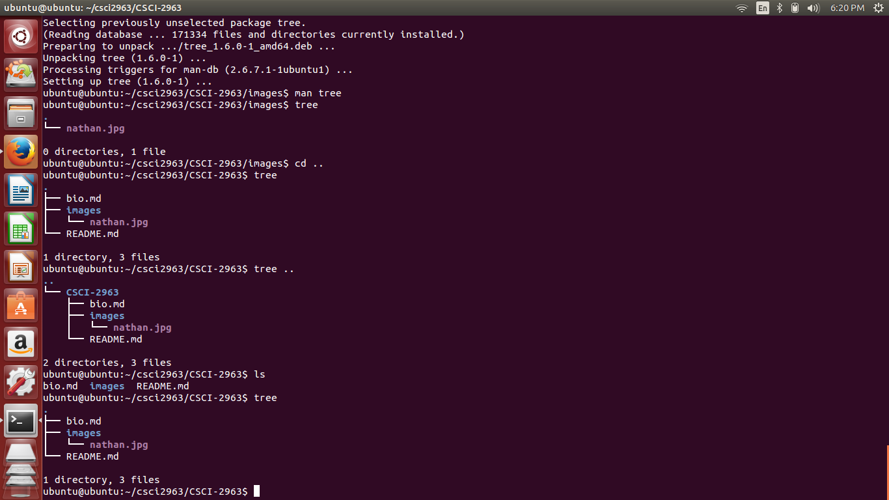
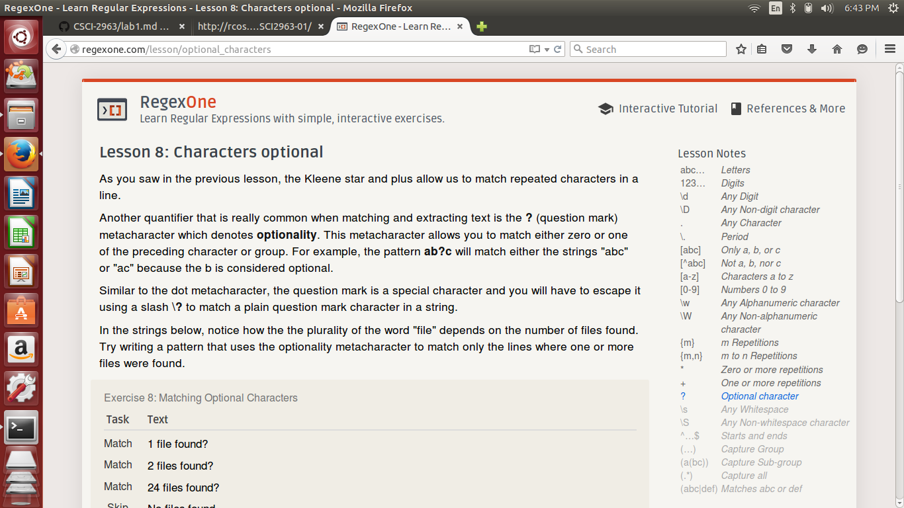
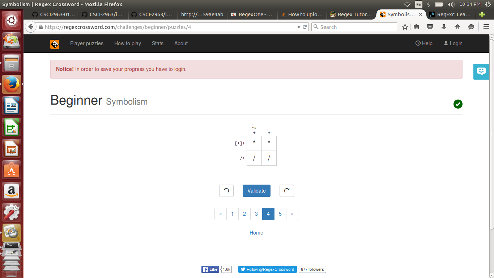
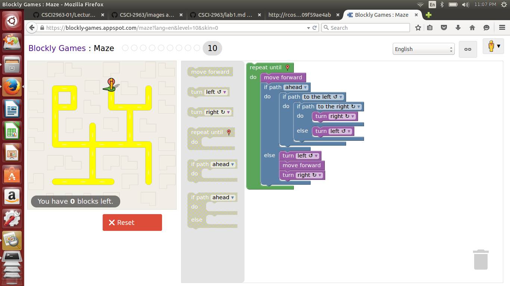

Screenshot of tree output 
Screenshot of regexone 
Screenshot of crossword, solutions are help, bobe, oooo, and **//
Screenshot of maze 

--Thinking/finding a problem/project that interests me--

Looked at https://github.com/trending?since=weekly
The trending projects look a bit hard to get into.

Also looked at https://developers.google.com/open-source/projects?hl=en
Most projects look interesting.

Additionally, I perused https://en.wikipedia.org/wiki/List_of_free_and_open-source_software_packages

When we were first asked to think of an open-source project, I thought I'd want to add 'speed dial' functionality to Chrome, similar to the Opera Browser.  To my dismay, that was actually a project the previous class had already done.  I'm not exactly sure what I'd like to do for a project just yet.  I think something to do with the web or C++, because those are areas I'd like to be more expirenced in.  I feel as though I have a pretty good grasp of Java and Android Studio.  Though I'm not against using them in a project.  I'm pretty open towards any project; though, at this point, I think I would want to join another team as I do not have an idea that hasn't been done already.
